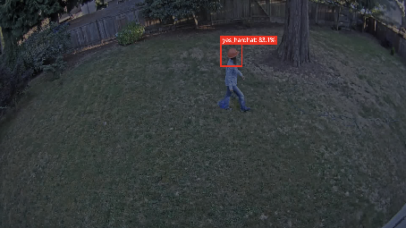
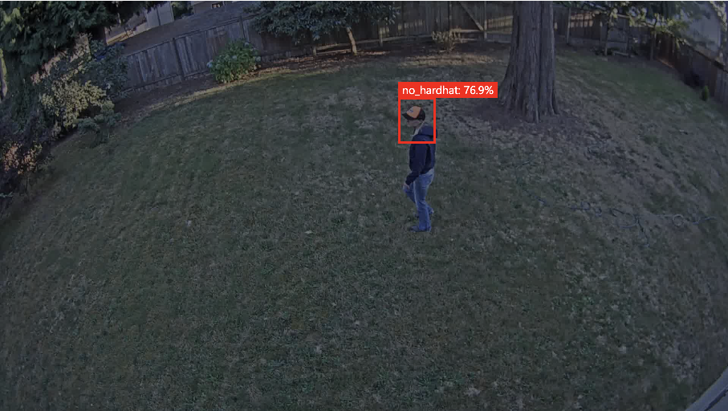

# Using a Custom Vision Model on an NVIDIA Jetson Device with Docker

This repo provides a sample of a [Custom Vision Service](https://docs.microsoft.com/en-us/azure/cognitive-services/custom-vision-service/) ONNX model running in a docker container on an Xavier AGX NVIDIA Jetson device.  It utilizes the NVIDIA GPU for predictions.  The resulting docker image will be compatible with [Live Video Analytics on IoT Edge](https://docs.microsoft.com/en-us/azure/media-services/live-video-analytics-edge/).

Note:  this repo is updating often to fix issues as it is a work in progress.  Please excuse the iterations.  It will be noted here when things are more stable.  Thank you for your patience.

## Tested setup(s)

**Jetson AGX Xavier**

- Jetson AGX Xavier flashed with JetPack 4.4 (L4T R32.4.3) with all ML and CV tools (**including** `nvidia-docker`)
- 8-16 GB swap file (on NVMe mount if using one, otherwise main storage disk) for expanding memory during prediction
- Additional NVMe (512 GB SSD used)
  - Set docker to use the NVMe drive for docker images and containers

**Software on device**

- OS:  Ubuntu 18.04 LTS
- JetPack 4.4 
- Azure CLI installed on Jetson to push AI docker image
- Default is `nvidia-docker` (do not need Moby or Docker CE)
- IoT Edge runtime 1.0.10.x

**Notes**

- Building and running the docker images will be with `nvidia-docker`
- A swap file will be used to expand memory by 8-16GB on the SSD (see below setup details).

## Details for Jetson Xavier AGX hardware setup

> General getting started guides for all Jetson platforms:  https://developer.nvidia.com/embedded/learn/getting-started-jetson

### Additional Equipment

* Additional SSD like an NVMe 512GB (Xavier)
* A "host" machine with Ubuntu 16.04 or 18.04 (e.g. an AMD64-based Lenovo Thinkpad) for NVIDIA SDK Manager
* Mouse and keyboard (wired USB)
* Monitor (HDMI)
* [Recommended] USB hub for peripherals
  * Note:  USB devices share power and the more you have, the more power gets used

### Prepare to flash Jetson

* Download the [NVIDIA SDK Manager for JetPack 4.4 (not the SD card method)](https://developer.nvidia.com/jetpack-sdk-44-archive) to the host machine (an [NVIDIA Developer membership](https://developer.nvidia.com/developer-program) may be required)

### Flash device

> IMPORTANT:
> - Plug in all peripherals and host before plugging into power
> - Ensure you select all ML tools, CV tools, **and** `nvidia-docker`.

Note:  The manual method was chosen in this guide during flashing through the NVIDIA SDK Manager.  Follow the [instructions online](https://docs.nvidia.com/sdk-manager/install-with-sdkm-jetson/index.html).

### Install an SSD NVMe

> Note:  other Jetson devices may not support NVMe w/ an M.2 connector

- Follow this tutorial to install the NVMe SSD ((512 GB used here)) on the Xavier:  https://www.jetsonhacks.com/2018/10/18/install-nvme-ssd-on-nvidia-jetson-agx-developer-kit/.

### Set up the NVMe SSD

In the terminal, mount the SSD as follows (example).

```
cat /proc/partitions
(echo o; echo n; echo p; echo 1; echo ""; echo ""; echo w; echo q) | sudo fdisk /dev/nvme0n1
cat /proc/partitions
sudo mkfs.ext4 /dev/nvme0n1p1
# Look at the output to get your own UUID
sudo vim /etc/fstab
# UUID=<block id> /media/nvme ext4 defaults 0 0
# For example:
# UUID=13024e1e-cfa1-4f99-a40b-d3cdccc37869 /media/nvme ext4 defaults 0 0
sudo mkdir /media/nvme
sudo chmod 777 /media/nvme
sudo mount /media/nvme/
sudo reboot
```

### Reconfigure Docker to use new NVMe (and `nvidia-docker`)

Here, we will modify the `etc/docker/daemon.json` file to add the data root for docker assets to point to the NVMe SSD and the NVIDIA runtime setting.

Create the docker directory and open the docker daemon config file with a text editor.
```
sudo mkdir /media/nvme/docker
sudo vim /etc/docker/daemon.json
```

Ensure the `/etc/docker/daemon.json` includes the following.

```
{
    "data-root": "/media/nvme/docker",

    "runtimes": {
        "nvidia": {
            "path": "nvidia-container-runtime",
            "runtimeArgs": []
        }
    }
}

```

And restart:

```
sudo systemctl restart docker
```

Give the user sudo permission to run docker by following https://docs.docker.com/engine/install/linux-postinstall/#manage-docker-as-a-non-root-user.

### Create a Swap File

Create a swap file on the NVMe SSD so that there will be enough memory to load and run machine learning models and the necessary containers.  Create a 16GB file according to the following:  https://linuxize.com/post/how-to-add-swap-space-on-ubuntu-18-04/#creating-a-swap-file (using `/media/nvme/swapfile` as file location).

Additionally, swappiness of the swapfile (e.g. the `/media/ssd/swapfile`) may be increased with the following ([Source](https://haydenjames.io/linux-performance-almost-always-add-swap-part2-zram/)).

First, check the value of swappiness.  The number can be from 0-100, but the default is usually 60.

```
sudo cat /proc/sys/vm/swappiness
```

Temporarily set swappiness to a more aggressive number (it will tend to use the swap more) with the following (note:  this will not persist after reboot).

```
sudo sysctl -w vm.swappiness=90
```

Once you know what swappiness works best, you may set it permanently by adding or replacing this line in `/etc/sysctl.conf` file (try a higher value to prioritize using the swap file, e.g., 90 is used here).

```
vm.swappiness=90
```

Swappiness values may need to be tested and adjusted as needed.

## Install Python 3

It is nice to have Python for local testing and is required for the Azure CLI to work.  However, most work will be from docker containers and one can always run a bash shell inside a running container for Python.

> Note: Python3 may already be on the device so you may check by typing `python3` on the command line, however often `pip3` is _not_ installed.

Install `python3` and `pip3` as shown here.  Then, add `ln -s /usr/bin/python3 /usr/bin/python` afer the `apt-get install`.

```bash
sudo apt-get update
sudo apt-get install -y \
    build-essential \
    libffi-dev \
    libssl1.0.0 \
    libssl-dev \
    python3-dev \
    python3-pip
```

## Install the Azure CLI from Python package repo (PyPI)

There are two ways to install the Azure CLI on Linux.  The first is the way recommended in [Azure docs](https://docs.microsoft.com/en-us/cli/azure/install-azure-cli-linux?pivots=apt).  The second is through PyPI, the Python package repo.  Here, PyPI is used and works well.

Install the Azure CLI as a Python package as follows (you will need [Python3 and Pip3 installed](#install-python-3) on your system).

```
pip3 install azure-cli
```

## Instructions to create ML model

> Note:  This is roughly following the [Tutorial: Analyze live video with Live Video Analytics on IoT Edge and Azure Custom Vision]() doc where you can find the video and necessary data to train a toy truck detector model.

### 1. Use CustomVision to train an object detection model

Follow [Quickstart: Build an object detector with the Custom Vision website](https://docs.microsoft.com/en-us/azure/cognitive-services/custom-vision-service/get-started-build-detector) to train an object detector with your images.

Notes

  - Use object detection and **"General (compact)"** as "Domain" ("compact" will ensure we can export for IoT Edge and model is of a smaller architecture)
  - If there are multiple classes, ensure a balanced dataset, that is, same number of images in each class for best performance ([other tips from Microsoft](https://docs.microsoft.com/en-us/azure/cognitive-services/custom-vision-service/getting-started-improving-your-classifier))
  - Export as ONNX --> ONNX Float16 (the float16 means the model has been quantized to decrease its memory footprint)
  - Locate the `model.onnx` and `labels.txt` files in the downloaded folder.

Example of hardhat detection (two-class) with Custom Vision (using the "Quick Test" feature after training):





### 2. Add model and labels to this project

- Place the `model.onnx` model file and the `labels.txt` labels file into the `customvision-linux-arm/app` folder from this repo (if there is a `labels.txt` already, just overwrite with the newly exported one).

### 3. Build the docker image

Note:  this will build the image based on the `Dockerfile`.  Use a tag that is **not "latest"** so that it's easy to upgrade as needed (e.g. shown here as `0.0.1`).

```
cd customvision-linux-arm
nvidia-docker build -t objectdetection:0.0.1 -f onnx.dockerfile .
```

### 4. Test container predictions

Use an image file similar to your training dataset in the following instructions.

Use the following command to start the container.

```
nvidia-docker run --name my_cvs_container -p 127.0.0.1:80:80 -d objectdetection:0.0.1
```

Use the following command to predict on an image (use full path of image on system, replacing the `<>` with the path).

```
curl -X POST http://127.0.0.1:80/image -F imageData=@<full path to a test image file that has the object(s)>
```

The results will look like:

```
{"created":"2021-01-30T00:30:42.895140","id":"","iteration":"","predictions":[{"boundingBox":{"height":0.12187065,"left":0.76290076,"top":0.32214137,"width":0.05968696},"probability":0.78185642,"tagId":0,"tagName":"no_hardhat"}],"project":""}
```

> TIP:  The position indicated by "left" and "top" refers to the distances from the top-left corner of the image

To test that the container is using GPU, check the [Troubleshooting](#troubleshooting) section for instructions on using `jtop` during a prediction.

### 5. Use with Live Video Analytics on IoT Edge

1. Retag the docker image according to the name of your Azure Container Registry, e.g.,

```
docker tag objectdetection:0.0.1 myacr.azurecr.io/objectdetection:0.0.1
```

> TIP: Always use a unique tag (e.g. `:0.0.1`) for each time you push a significant change to ACR - this makes it easy to keep track of iterations and ensure you are on the latest image in the IoT Edge runtime.

2. This docker image can now be [pushed to Azure Container Registry with the Azure CLI](https://docs.microsoft.com/en-us/azure/container-registry/container-registry-get-started-docker-cli) and used with Live Video Analytics on IoT Edge on a Jetson device registered with Azure IoT Hub

3. [Get certificates and proper access to install the IoT Edge runtime and resources according to Azure docs](https://docs.microsoft.com/en-us/azure/iot-edge/how-to-install-iot-edge?view=iotedge-2018-06#prerequisites).

> IMPORTANT:  You don't need Moby Engine/runtime because you already have the NVIDIA docker runtime (`nvidia-docker`)

4. [Install the IoT Edge security daemon according to Azure docs](https://docs.microsoft.com/en-us/azure/iot-edge/how-to-install-iot-edge?view=iotedge-2018-06#install-the-iot-edge-security-daemon).

5. Set the device connection string on the device by updating `/etc/iotedge/config.yaml` line 88 (as of this writing) with the proper `device_connection_string` from the [Azure Portal](https://portal.azure.com) from the desired device registration within the IoT Hub resource.

6. Create the video input folder and video output folder and set permissions.  For example:

```
sudo mkdir -p /live/mediaServer/media
sudo chmod -R ugo+rw /live/mediaServer/media
sudo mkdir /media/nvme/output
sudo chmod -R ugo+rw /media/nvme/output
```

7. Download the test toy truck video to the Jetson device.  This is the video that the RTSP simulator module/container will use.

```
cd /live/mediaServer/media
wget https://lvamedia.blob.core.windows.net/public/t2.mkv
```
8.  Clone the Live Video Analytics Python sample.

```
git clone https://github.com/Azure-Samples/live-video-analytics-iot-edge-python.git
```

9. Follow the rest of the tutorial starting at https://docs.microsoft.com/en-us/azure/media-services/live-video-analytics-edge/custom-vision-tutorial?pivots=programming-language-python#examine-the-sample-files.


IMPORTANT:

- Ensure the "cv" ML IoT module has the following `createOptions` (see the included `deployment.customvision.arm64.template.json` deployment manifest):

    ```
    "createOptions": {
      "HostConfig":{"runtime": "nvidia",
      "Privileged":true}
    }
    ```

- Ensure the docker daemon config is using the NVIDIA runtime.  This config may be found at `/etc/docker/daemon.json` and will look like (or similar to):

    ```
    {
        "runtimes": {
            "nvidia": {
                "path": "nvidia-container-runtime",
                "runtimeArgs": []
            }
        }
    }
    ```

## Troubleshooting

- **Check that the GPU is being utlized**

To check with a package called `jetson-stats`, Python3 is needed (on Jetson, `nvidia-smi` is not available).  Install Python as follows.

```
sudo apt-get update
sudo apt-get install -y \
    build-essential \
    libffi-dev \
    libssl1.0.0 \
    libssl-dev \
    python3-dev \
    python3-pip
```

Install `jetson-stats` ([more here](https://github.com/rbonghi/jetson_stats)):

```
sudo pip3 install jetson-stats
```

Run the tool to check resource management and usage:

```
jtop
```

- **If the device is sluggish or appears frozen**

To work with a device that is sluggish, try to SSH in with the command line from a host computer rather than with a USB-attached keyboard and mouse and HDMI attached monitor (turn off device and dettach all of these components, then power back on).  This will usually allow more responsiveness.

If the device is still slow or LVA module is throwing errors related to secrets, even after using an SSH method, try the following (this is to delete app data for LVA module and reset it):
  1. Stop IoT Edge runtime
  `sudo systemctl stop iotedge`
  2. Delete the application data associated with LVA (this is specified in the `.env` on the dev machine - in deployment manifest file as well).
  e.g. `sudo rm -fr /var/lib/azuremediaservices/*`
  3. Start IoT Edge runtime
  `sudo systemctl start iotedge`

- **If prediction is unacceptably slow**

To speed up the time for prediction, adjust the input resolution on line 18 of `<path to repo>/jetson-customvision/customvision-linux-arm/object_detection.py` (https://github.com/michhar/jetson-customvision/blob/main/customvision-linux-arm/app/object_detection.py#L18) to be smaller, e.g., `416 * 416`.
